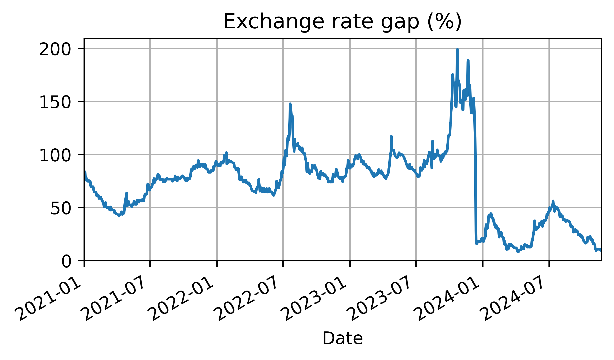

# Argentina Peso (ARS) Exchange Rate Gap

The exchange rate gap is the difference between the official exchange rate and the Blue-dollar exchange rate.
$$\mathrm{gap} = \frac{\mathrm{Blue} - \mathrm{Official}}{\mathrm{Official}} \cdot 100 \% $$


## How to run the script
Install the requirements.
```bash
pip install -r requirements.txt
```
Then run main.py.
```bash
python main.py
```

## Source
https://api.bluelytics.com.ar/v2/evolution.json
